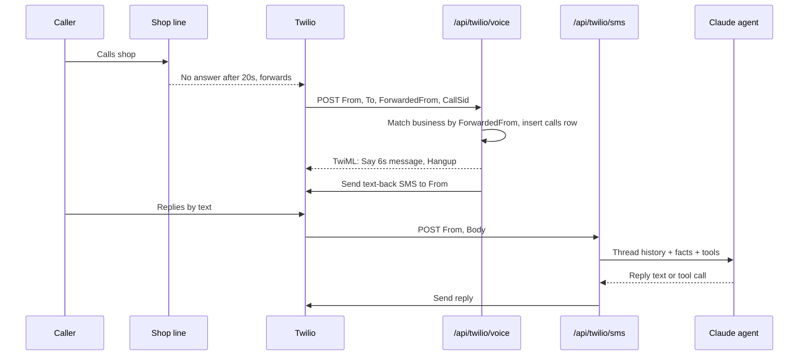

# Pickup by aidentity — Claude Code Build Spec & Monday Launch Plan

2026-09-19 · @Someone

## Weekend timeline

Monday you sell with a working demo, a scorecard, a pricing page and a Stripe checkout; paid clients go live once their Twilio toll-free number is verified (2–5 business days), so first go-lives land Wednesday–Friday.

| When | Steven does | Claude Code builds |
| --- | --- | --- |
| Sat 2–5 PM | Open every account in Section 2. Submit Twilio toll-free verification. Install Claude Code. | — |
| Sat 5–9 PM | Paste the kickoff prompt (Section 11). Answer its questions. Paste keys into `.env`. | Scaffold, schema, Twilio webhooks, agent loop (Phases 1–3) |
| Sun 9 AM–12 PM | Build The Interview agent in Retell's visual builder from Section 12. Test-call your own cell. | Stripe deposits + subscription, owner alerts (Phases 4–5) |
| Sun 12–4 PM | Test Catch end to end on your own phone (Section 14). Screenshot errors to Claude Code. | Weekly report, onboarding-by-text, fixes (Phases 6–7) |
| Sun 4–7 PM | Run The Interview against 20 Charlotte HVAC shops. Score them. Load the pricing page. | Deploy to Vercel, production env |
| Mon 7–9 AM | Text the 20 scorecards (Section 13). | — |
| Mon 9 AM–5 PM | Work replies, book 5 calls, close on Stripe checkout. | Bug fixes as you find them |
| Tue–Fri | Onboard closes by text as their numbers verify. Run 40 more Interviews. | — |

Time from you this weekend: about 10 hours, most of it testing and calling.

## Accounts and keys (do today)

Eight accounts, about 90 minutes, under $60 out of pocket. Twilio verification is the only one with a wait, so do it first.

| Order | Account | What to do | Key to save in `.env` |
| --- | --- | --- | --- |
| 1 | Twilio (twilio.com) | Upgrade from trial ($20 credit). Buy one toll-free number (8XX). Submit toll-free verification: business name, website, use case "Customer service: missed-call follow-up texts for home service businesses", sample message from Section 7, opt-in "customer called the business". | `TWILIO_ACCOUNT_SID`, `TWILIO_AUTH_TOKEN`, `TWILIO_NUMBER` |
| 2 | Anthropic Console (console.anthropic.com) | Create API key. Add $20 credit. | `ANTHROPIC_API_KEY` |
| 3 | Supabase (supabase.com) | New project "pickup", region us-east-1. Copy URL and service-role key. | `SUPABASE_URL`, `SUPABASE_SERVICE_KEY` |
| 4 | Stripe (stripe.com) | Activate account (SSN, bank). Create two products: Catch $199/mo, Answer $399/mo. Create payment links for each. | `STRIPE_SECRET_KEY`, `STRIPE_WEBHOOK_SECRET` |
| 5 | Vercel (vercel.com) | Sign up with GitHub. Nothing else until deploy. | — |
| 6 | GitHub (github.com) | Create empty private repo `pickup`. | — |
| 7 | Retell (retellai.com) | Sign up, $10 free credit, buy one local 704 number for The Interview. | `RETELL_API_KEY` (later) |
| 8 | Claude Code | Install the desktop app, sign in, open the `pickup` folder. | — |

- [ ] Twilio toll-free verification submitted (note the date)
- [ ] Stripe account activated and both payment links copied into Section 13
- [ ] All keys pasted into a text file you keep off GitHub

While toll-free verification is pending, Twilio lets you text only numbers you have verified in the console. Add your own cell and one friend's so Sunday's tests work.

## Phase 1 scope

Pickup (Catch tier) ships five features and nothing else this weekend.

1. **30-second text-back.** A call the client misses hits our Twilio number; the caller gets a text within 30 seconds, 24/7.
2. **AI qualification and booking.** Claude runs the SMS conversation: problem, address, urgency, then offers real slots from the client's availability and books one.
3. **Deposit collection.** After booking, a Stripe link for the client's diagnostic fee or deposit; appointment flips to confirmed on payment.
4. **Owner Live Line.** One text to the owner per lead (who, what, where, urgency, score, booked or not) and "ask your desk" replies to the owner's questions.
5. **Weekly Revenue Recovered text.** Every Monday 7 AM: calls missed, texted, leads, booked, deposits, estimated revenue.

Out of scope until a paying client asks: voice receptionist (Answer tier), Google Calendar sync, web dashboard, estimate follow-up sequences, review requests, AI visibility scan integration, multi-location. Owner onboarding and availability are set entirely by text.

## Architecture and stack

One Next.js app on Vercel with three webhooks and one database. No Zapier, Make, Calendly or n8n.

| Layer | Choice | Why |
| --- | --- | --- |
| App | Next.js 15 (App Router, TypeScript), route handlers for webhooks | One repo, one deploy, Claude Code knows it cold |
| Hosting | Vercel (Hobby is fine to start) + Vercel Cron | Push to deploy, free until real volume |
| Database | Supabase Postgres via `@supabase/supabase-js` (service role, server only) | Managed, free tier, SQL Claude Code can migrate |
| Telephony | Twilio Programmable Voice + Messaging, one toll-free number shared across clients | Toll-free verifies in days; caller-to-client mapping done by the forwarded number |
| Agent | Anthropic Messages API, `claude-sonnet-4-5`, tool use | Reliable structured tool calls at low cost per conversation |
| Payments | Stripe Checkout (client deposits, Stripe Connect Express later) and Stripe Payment Links (aidentity subscriptions) | Deposits first land in your Stripe and are paid out to the client weekly until Connect is on |
| Alerts | Twilio SMS to the owner's cell | Owners live in a truck, not an inbox |

```mermaid
flowchart LR
  A[Customer calls shop] --> B[Shop phone rings 20s]
  B -->|no answer: forward| C[Twilio number]
  C --> D[/api/twilio/voice]
  D --> E[Play 6s message, hang up]
  D --> F[Send text-back]
  F --> G[/api/twilio/sms]
  G --> H[Claude agent + tools]
  H --> I[(Supabase)]
  H --> J[Stripe deposit link]
  H --> K[Owner Live Line SMS]
```

Every inbound call and text is written to the database before anything else runs, so a crash never loses a lead.

Multi-tenant note: one shared toll-free number keeps Phase 1 simple; the client is identified by the `ForwardedFrom` (or `To`) number on the voice webhook, and the caller's phone is mapped to that client for the SMS thread. If two clients' customers text the same number, the most recent open lead for that caller wins. Dedicated numbers per client come in Phase 2 when clients ask.

## Database schema

Eight tables, all with `id uuid`, `created_at`, `updated_at`. Claude Code writes the migration as `supabase/migrations/0001_init.sql`.

| Table | Key columns | Purpose |
| --- | --- | --- |
| `businesses` | `name`, `owner_name`, `owner_cell`, `forward_number` (the shop line), `timezone`, `facts jsonb` (Section 10), `deposit_cents`, `deposit_label`, `stripe_customer_id`, `plan` (catch/answer), `status` (trial/active/paused) | One row per client |
| `availability` | `business_id`, `weekday` 0–6, `start_time`, `end_time`, `slots_per_window`, `window_minutes` (default 120) | Owner's bookable windows, set by text |
| `calls` | `business_id`, `caller_phone`, `twilio_call_sid`, `caller_type` (human/ai\_agent/unknown), `missed_at`, `texted_at` | Every forwarded call |
| `leads` | `business_id`, `phone`, `name`, `address`, `zip`, `job_type`, `urgency` (emergency/soon/flexible), `summary`, `score` 0–100, `status` (new/qualifying/booked/confirmed/escalated/lost), `est_value_cents` | The conversation's outcome |
| `messages` | `lead_id`, `role` (customer/agent/owner/system), `body`, `twilio_sid` | Full SMS transcript |
| `appointments` | `lead_id`, `business_id`, `starts_at`, `ends_at`, `status` (held/confirmed/cancelled/completed), `deposit_status` (none/sent/paid) | Booked slots |
| `payments` | `appointment_id`, `stripe_session_id`, `amount_cents`, `status`, `paid_at` | Deposit tracking |
| `events` | `business_id`, `lead_id`, `type`, `data jsonb` | Append-only ledger that feeds the weekly report |

Indexes: `leads(business_id, phone, status)`, `calls(business_id, missed_at)`, `appointments(business_id, starts_at)`, `events(business_id, created_at)`.

Row-level security is off in Phase 1 because only the server touches the database with the service key. Turn it on before any client-facing dashboard exists.

## Twilio call and SMS flow

The client changes one carrier setting; everything else is two webhooks.

**Client setup (2 minutes, done by text with you on the phone):** on the shop's main line, enable conditional call forwarding to the Twilio number. Verizon: dial `*71` + Twilio number (no-answer forwarding), `*73` to cancel. AT&T: `*61*` + number + `#`. T-Mobile: `**61*` + number + `#`. Ring time stays at the carrier default (about 20 seconds). VoIP systems (RingCentral, Ooma, Grasshopper): "forward on no answer" in their admin, same target.



**`POST /api/twilio/voice`** (TwiML response):

1. Validate the Twilio signature.
2. Look up `businesses.forward_number = ForwardedFrom` (fall back to `To` if the carrier strips it; log a warning).
3. Insert `calls` row. If `From` is anonymous or a known Google agent pattern (see Section 7), set `caller_type`.
4. Return TwiML: `<Say voice="Polly.Joanna">Thanks for calling {name}. We're on a job right now. We're texting you this second so we can get you taken care of.</Say><Hangup/>`.
5. Fire the text-back (target under 30 seconds from the missed call):

```markdown
Hi, this is {name} — sorry we missed your call! What's going on with your {trade_noun}? Reply here and we'll get you on the schedule. (Text STOP to opt out)
```

**`POST /api/twilio/sms`**:

1. Validate signature. If `Body` is STOP/UNSUBSCRIBE, mark the lead `lost` and reply once with confirmation; Twilio's Advanced Opt-Out handles the rest.
2. If `From` is a business owner's cell, route to the owner command handler (Section 9).
3. Otherwise find the open lead for `From` (newest, status not lost/completed); create one if none.
4. Append the customer message, call the agent (Section 7), send its reply, append it.
5. Reply with empty TwiML so Twilio does not double-send.

**`POST /api/stripe/webhook`**: on `checkout.session.completed`, mark the payment paid, appointment `confirmed`, text the customer a confirmation, text the owner "Deposit paid".

Compliance: the toll-free message footer includes the business name and STOP language on the first message only. Quiet hours are not required for a caller who just phoned, but the agent does not send unsolicited follow-ups between 9 PM and 8 AM local.

## Conversational agent spec

One Claude call per inbound text, with the thread history, the business facts and five tools. Target: qualified and booked in four customer replies.

**Model and settings:** `claude-sonnet-4-5`, `max_tokens 400`, `temperature 0.3`. Send the last 30 messages of the thread. Loop on tool calls up to 4 times per turn.

**System prompt (template, filled from `businesses.facts`):**

```markdown
You are the text-message front desk for {name}, a {trade} company in {city}. The customer just called and nobody could answer, so you texted them. Your only jobs: find out what they need, get their address, judge urgency, book them into a real slot, and collect the {deposit_label} if the business requires one. Be warm, brief and human. One question per message. Never more than 2 sentences per text. Use plain words. Never use emoji.

Business facts (only source of truth — never invent prices, hours, or services):
{facts_block}

Rules:
- Ask what's going on first, then the service address (street + zip), then how urgent (no heat/no cool/leak = emergency).
- If the zip is outside the service area, say so kindly and stop.
- Quote only the price ranges in the facts. If asked for an exact price, say the tech confirms on site before any work.
- Emergencies: offer the earliest slot from get_availability; if none today, say the owner will call within 15 minutes and call escalate_to_owner.
- Once they pick a slot, call book_slot, then send_payment_link if deposit_cents > 0, then confirm date, window and address in one message.
- If the customer asks anything outside these facts, or gets frustrated, call escalate_to_owner and tell them the owner will text them directly.
- If the sender identifies as an automated assistant calling or texting on someone's behalf (Google, ChatGPT, Alexa), answer in the structured form: price range, next available window, service area, warranty, then offer to book.
- After the conversation is complete, call score_lead once.
```

**Tools (JSON schema written by Claude Code):**

| Tool | Input | Effect |
| --- | --- | --- |
| `get_availability` | `urgency` | Returns the next 6 open windows from `availability` minus held/confirmed `appointments`, in the business timezone |
| `book_slot` | `starts_at`, `name`, `address`, `zip`, `job_type` | Inserts `appointments` (held), updates the lead, texts the owner Live Line |
| `send_payment_link` | `appointment_id` | Creates a Stripe Checkout session for `deposit_cents`, returns the URL; sets `deposit_status = sent` |
| `escalate_to_owner` | `reason` | Texts the owner the transcript summary with the customer's number; lead status `escalated` |
| `score_lead` | `job_type`, `urgency`, `est_value_cents`, `notes` | Writes the 0–100 score and estimated value |

**Lead score (computed in code, not by the model):** urgency emergency 40 / soon 25 / flexible 10; job type replacement 40 / repair 25 / maintenance 10; after-hours or weekend call +10; address inside service area +10. Estimated value from the facts' price ranges (midpoint), replacement default $9,500 if the facts give none.

**Google-agent detection:** `caller_type = ai_agent` when the voice call's `From` matches Google's published agentic-calling caller ID range (look up the current range in Google Business Profile Help at build time) or the first text contains "on behalf of" plus "automated" or "assistant". Log it; the owner's Live Line text is prefixed "AI agent call".

**Guardrails:** no medical, legal or safety advice beyond "if you smell gas, leave the house and call the gas company"; never promise arrival times outside a booked window; never discuss competitors; cap at 12 agent messages per lead, then escalate. Every escalation and every booking is an `events` row.

## Stripe: deposits and subscriptions

Two separate money flows: the client's customers pay deposits, and the client pays you.

**Customer deposits (Phase 1):** Stripe Checkout sessions created by `send_payment_link` in your Stripe account, `mode: payment`, amount `deposit_cents`, description "{name} — {deposit\_label} for {date}", `metadata.appointment_id`. Funds land in your account; you pay each client out weekly by ACH from the `payments` table until Stripe Connect Express is live (Phase 2, about a day of work). Put that in the client agreement: "Deposits collected on your behalf are remitted every Friday less Stripe fees." Default deposit: $89 diagnostic fee for HVAC and plumbing, $0 for shops that don't charge one (the agent then skips the link).

**aidentity subscriptions:** two Stripe Payment Links, Catch $199/mo and Answer $399/mo, 14-day trial, cancel anytime. The `checkout.session.completed` webhook with `mode: subscription` creates or activates the `businesses` row from the customer's email and phone, then texts the owner the onboarding opener (Section 10). Failed payments after 7 days pause the number forward instructions (the software keeps working; you call the owner).

## Owner alerts, ask-your-desk, weekly report

The owner never logs into anything in Phase 1; the product is the texts on their phone.

**Live Line (per lead, sent on booking, escalation, or 10 minutes after the last customer message):**

```markdown
NEW LEAD (score 82)
Maria Lopez • 704-555-0142
9124 Blakeney Heath Rd, 28277
AC not cooling, 2nd floor • EMERGENCY
Booked Tue 9/22 8–10 AM • $89 deposit PAID
Reply with a number to text her directly.
```

AI agent calls are prefixed `AI AGENT CALL (Google)`; missed calls with no text reply after 30 minutes send `Missed call, no reply yet: 704-555-0199 • tap to call`.

**Ask-your-desk (owner texts the Twilio number):** a second Claude prompt over the business's last 7 days of `leads`, `appointments` and `calls`. Supported: "who called today", "what's booked tomorrow", "any emergencies", "how many missed this week", "text Maria we're running 20 late" (sends on the owner's behalf, logged), "close Friday afternoon" / "open Sat 8–12" (edits `availability`), "pause" / "resume" (stops text-backs). Anything else: "I can't do that yet — text Steven at {your cell}."

**Weekly Revenue Recovered (Vercel Cron, Mondays 7 AM local):**

```markdown
QUEEN CITY COMFORT • Week of Sep 14
Calls missed: 23 → texted within 30s: 23
Replied: 15 • Leads: 12 • Booked: 8 • Deposits: $712
Est. revenue recovered: $5,400 (8 jobs × your avg $675)
3 AI agent calls answered
Top fix this week: you missed 6 calls Tue 8–10 AM — want a second ring group? Reply YES.
```

Estimated revenue = booked jobs × the average ticket the owner gave at onboarding (never a claim of actual revenue). The same numbers append to `events` so month-over-month trends exist from day one.

## Client onboarding by text

A new client is live in one text conversation; the answers become `businesses.facts`, which powers everything the agent says.

After Stripe checkout the owner's cell gets the opener from the Twilio number, and a Claude onboarding prompt walks them through ten questions, one at a time, accepting messy answers:

1. Business name and the phone number customers call
2. Trade and services ("HVAC repair, maintenance, replacement, no duct cleaning")
3. Service area as zips or towns
4. Hours, and whether they take emergency calls after hours
5. Price ranges: diagnostic fee, common repairs, replacement range
6. Deposit or diagnostic fee to collect when booking, if any
7. Bookable windows ("Mon–Fri 8–10, 10–12, 1–3, 3–5, two techs")
8. Warranty and licensing lines they want quoted
9. Average ticket for the weekly report
10. Anything the front desk should never say

The agent echoes back a facts summary; the owner replies OK or corrects. Then the carrier forwarding code for their carrier (Section 6) and a test: you call the shop line, let it ring out, and the owner watches the text-back arrive. Total: about 12 minutes. `facts` is a jsonb the owner can update any time by texting "update: we now charge $99 diagnostic".

## Claude Code build order and kickoff prompt

Seven phases; Claude Code should finish each with a passing local test before starting the next.

| Phase | Builds | Done when |
| --- | --- | --- |
| 1 | Next.js scaffold, env loading, Supabase client, migration `0001_init.sql`, seed script with one test business (yours) | `npm run dev` boots, tables exist in Supabase |
| 2 | `/api/twilio/voice` + signature validation + text-back send | Calling the Twilio number from your cell produces the text-back |
| 3 | `/api/twilio/sms`, agent loop, five tools, availability logic, lead scoring | A full booking happens by text on your phone |
| 4 | Stripe Checkout for deposits + webhook; subscription webhook creating businesses | Test-mode deposit flips an appointment to confirmed |
| 5 | Owner Live Line + ask-your-desk command handler | Owner cell receives lead texts and can ask "who called today" |
| 6 | Weekly report cron, onboarding-by-text flow | `vercel cron` dry run sends the report; onboarding creates a facts jsonb |
| 7 | Deploy to Vercel, production env, Twilio webhooks pointed at prod, README runbook | Real call to your cell works end to end on prod |

**Kickoff prompt (paste into Claude Code in the empty `pickup` folder, then paste this whole doc's export as `SPEC.md` when it asks):**

```markdown
You are building Pickup, a missed-call-to-booked-job SMS product for home service businesses. The full spec is in SPEC.md in this folder — read it completely before writing code. Stack: Next.js 15 App Router + TypeScript, Supabase Postgres (service role from the server only), Twilio Voice + Messaging, Anthropic Messages API with tool use (claude-sonnet-4-5), Stripe Checkout, Vercel with Vercel Cron. No other services.

Work through the seven phases in the "Claude Code build order" section in order. For each phase: write the code, write a minimal test or a curl script under /scripts that proves it, run it, fix failures, then stop and tell me in plain English what to do next (which button to click, which key to paste, which number to call). I am not a developer; assume I will only run the commands you give me verbatim.

Rules: validate every Twilio and Stripe webhook signature; write every inbound call and message to the database before doing anything else; never let the agent invent prices, hours or services beyond businesses.facts; keep all secrets in .env.local and never commit them; add a README.md runbook covering deploy, adding a client, rotating keys, and what to do when a text fails.

Start with Phase 1. Ask me for the Supabase URL and service key before running the migration.
```

Expect 8–12 hours of Claude Code wall time across Saturday night and Sunday, mostly waiting on tests. When it asks a product question the spec doesn't answer, choose the simplest option and note it in the README.

## The Interview: Retell agent, scorecard, outreach

The Interview is a Retell voice agent that calls a shop the way Google's agent does, records the result, and hands you a scorecard to text the owner. Built in Retell's visual builder Sunday morning; no code.

**Retell setup:** Single-prompt agent, voice "Cimo" or any neutral female voice, LLM Claude Sonnet, outbound from your 704 number, call recording on, max duration 3 minutes, end call on silence 10 seconds, voicemail detection on (hang up; the voicemail *is* the result).

**Agent prompt:**

```markdown
You are an automated assistant calling on behalf of a homeowner in Charlotte who needs {trade} service. Say at the start, exactly: "Hi, this is an automated assistant calling on behalf of a customer who's looking for {trade} service. Do you have a quick second for three questions?" If they say no or ask to be removed, say "No problem, thanks" and end the call.

Ask, one at a time, waiting for each answer:
1. "What's your price range for a diagnostic visit or first service call?"
2. "What's your earliest availability this week?"
3. "Do you serve the {neighborhood} area, and is there a warranty on the work?"

Then say: "Thanks, I'll pass that along to the customer." and end the call. Do not sell anything. Do not answer questions about who the customer is; say you don't have that information. Be polite and brief.
```

Run it against the prospect's main line during business hours (10 AM–12 PM Sunday won't reach anyone; run 8 AM–10 AM Monday for the first batch, and Sunday only for shops advertising 24/7 service). Legal note: one call, clearly identified as automated, no sales pitch on the call; you are not selling on that call, you are sending a text afterward to a business number. Keep it that way.

**Scorecard (score in `scorecards.csv`, then text):**

| Field | How to score |
| --- | --- |
| Answered | Yes / voicemail / no answer; seconds until pickup or voicemail |
| Gave a price range | Yes / no / "have to call you back" |
| Gave availability | Yes / no |
| Confirmed service area | Yes / no |
| Google verdict | Answered + price + availability = "Would be recommended"; anything less = "Did not answer" or "Could not quote" |
| Grade | A: all four. B: answered, missed one. C: answered, no price. F: voicemail or no answer |

**Outreach text (send from your own cell, Monday 7–9 AM, 20 shops):**

```markdown
Hi {first name}, Steven with aidentity in Charlotte. Google's AI started calling home service shops this summer to get prices and availability for homeowners. I ran that exact call on {business} Sunday at {time} — it went to voicemail after 11 seconds, so you'd show up as "did not answer" next to 3 shops that quoted. 45-second recording here: {link}. I fix this for $199/mo with no contract: every missed call gets a text back in 30 seconds and gets booked. Worth 10 minutes this week?
```

For shops that answered but couldn't quote (grade C), swap the middle sentence: "your team picked up but couldn't give a price range, which Google reads as 'could not quote'." Host recordings as unlisted links (Retell gives a recording URL; a Google Drive folder works).

Target: 20 Interviews Sunday/Monday morning, 40 per week after. At roughly 60% F/C grades, that is 12 warm texts on Monday and 24 a week after.

## Monday sales kit

Goal for week one: 5 signed clients at $199, which is $995 MRR and five reference customers.

**Who to call first:** your 26 PRIME HVAC prospects plus 14 plumbers pulled the same way. Owner-operated, 2–15 techs, Google reviews under 150, no answering service in their voicemail greeting. Skip franchises and private-equity rollups (they have call centers).

**The 10-minute call:**

1. Play the recording. Let it sit. "That's what Google's assistant heard."
2. "How many calls a week do you think go to voicemail?" Whatever they say, double it out loud with the industry number: about a quarter, and most of those never call back.
3. "One missed AC repair is $450. One missed replacement is $9,000. This is $199 a month, no contract, and you don't change your phone number or anything Dana does."
4. Demo on their phone: have them call your test line, let it ring out, watch the text arrive, book a slot, get the deposit link.
5. Close: "I'll text you the checkout link now; we do a 12-minute setup by text today and you're live as soon as your texting number is verified this week. First 14 days free."

**Objections:**

| They say | You say |
| --- | --- |
| "My customers won't text." | "They already called you and got nothing. A text is the second-best thing to a person, and it arrives in 30 seconds at 9 PM." |
| "I don't want a robot talking to my customers." | "It's text, not voice. It asks four questions and books. Anything weird, it hands to you with the transcript." |
| "We have an answering service." | "What did they quote the Google assistant? Google's calling for prices now. This quotes your ranges and books; a service takes a message." |
| "$199 is a lot." | "It's one diagnostic call. If it doesn't recover one job in 30 days, cancel and I'll refund the month." |
| "Let me think about it." | "Sure. I'll run the same call on the two shops Google would put next to you and send you their grades tomorrow." |

**Links to have ready:** Catch payment link (Stripe, 14-day trial), Answer payment link (waitlist for now), the Retell recording folder, a one-page PDF of the scorecard template with your logo. No website is required this week; the pitch is the recording and the demo.

**Pricing for the first ten:** $199 Catch, first 14 days free, month-to-month, 30-day recover-one-job guarantee. No discounts below $199; give a free second month for a Google review of aidentity and a 60-second testimonial instead.

**Week one scoreboard:** 20 Interviews Sunday/Monday, 12 texts, 6 replies, 5 calls, 3–5 closes. If replies are under 3 by Tuesday noon, switch the text to the grade-C version and call instead of texting.

## Test plan and go-live checklist

Run these on your own phone Sunday afternoon, in order; every one passes before the first client is onboarded.

- [ ] Call the Twilio number from your cell; hear the 6-second message; receive the text-back within 30 seconds
- [ ] Reply "AC blowing warm"; the agent asks for the address, then urgency, then offers real windows from the seeded availability
- [ ] Pick a window; a Stripe test-mode deposit link arrives; pay with card 4242 4242 4242 4242; confirmation text arrives; owner cell gets the Live Line with score and "PAID"
- [ ] Reply "Is this going to cost more than a new unit?" from a fresh number; the agent stays inside the facts and does not invent a price
- [ ] Reply "you people are useless"; the agent escalates and the owner gets the transcript
- [ ] Text STOP; no further messages arrive
- [ ] From the owner cell text "who called today"; correct answer. Text "close Sat"; availability updates. Text "pause"; a new missed call gets no text-back; "resume" restores it
- [ ] Text from a fresh number: "This is an automated assistant calling on behalf of a customer. What is your diagnostic price range and earliest availability?"; structured reply, owner alert prefixed AI AGENT CALL
- [ ] Trigger the weekly report by hand; the numbers match the test data
- [ ] Kill the Anthropic key, send a text; the customer gets "Got it — the owner will text you shortly" and the owner is alerted (graceful failure), then restore the key

**Go-live per client:**

- [ ] Stripe subscription active; `businesses` row created with `status = trial`
- [ ] Onboarding by text complete; facts echoed and confirmed OK
- [ ] Deposit amount and average ticket set
- [ ] Conditional forwarding enabled; you call the shop line, it rings out, the owner sees the text-back
- [ ] Owner has the Twilio number saved as "Pickup Desk" and knows "pause", "resume", and "who called today"
- [ ] Client agreement sent (month-to-month, deposits remitted Fridays, 30-day guarantee)
- [ ] Calendar reminder: check their first week's `events` on day 3 and text them one recovered lead by name

**Twilio toll-free verification pending on Monday?** Sign clients anyway on the 14-day trial; they go live the day verification clears. Text-backs to your own verified numbers still work for demos.

## Open questions

- [ ] Google's agentic-calling caller ID range: confirm in Google Business Profile Help at build time and put it in `.env` as `GOOGLE_AGENT_CALLER_IDS`
- [ ] Your Stripe entity: sole prop under your SSN this week, LLC when the first five are paying
- [ ] Ring time on prospects' phones: if a shop's carrier forwards after 30+ seconds, coach them to set 20 during onboarding
